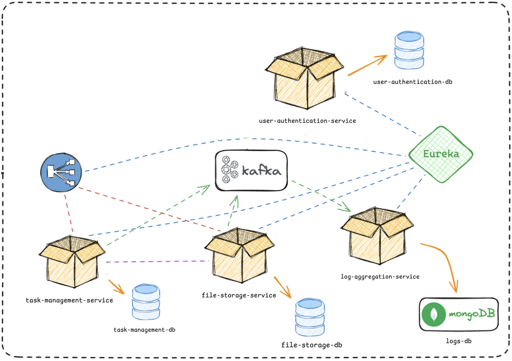

# Final Projesi - DefineX Java Spring Boot Bootcamp

Bu proje, DefineX Java Spring Boot Bootcamp'inin final projesidir. Mikroservis mimarisi uygulanarak geliştirilmiştir.

Website: [nbenlioglu.dev](https://www.nbenlioglu.dev/) 
LinkedIn: [Nikolay Benlioglu](https://www.linkedin.com/in/nikolay-benlioglu/) 
GitHub: [nbenliogludev](https://github.com/nbenliogludev) 
Email: [nikbenlioglu@gmail.com](mailto:nikbenlioglu@gmail.com)

## Kısaca Bazı Özellikler

- Her temel servisin kendi veritabanı bulunuyor.
- Kafka ile asenkron mesajlaşma sağlandı.
- Loglar için MongoDB kullanılıyor.
- Eureka service discovery yapısı hazırlandı.
- Postman üzerinden denenebilir.
- docker-compose.yml dosyası hazırlandı.
- Swagger API dokümantasyonu eklendi.

# Docker

Projeyi çalıştırmak için Docker kullanabilirsiniz. [Docker](https://www.docker.com/products/docker-desktop) sayfasından docker'ı indirebilirsiniz.

## Projeyi ayağa kaldıralım

1. Terminalinizi açın ve projenin ana dizinine gidin.
2. `docker-compose up -d` komutunu çalıştırın.
3. Tüm servislerin başlatılmasını bekleyin. (Epey sürebilir, sabırlı olun...)
4. Tüm servislerin başlatıldığını gördüğünüzde, API kullanılabilir durumda demektir (umarım)

Kapatmak için terminalinizden projenin ana dizinine gidin ve `docker-compose down` komutunu çalıştırın.

## Postman ile deneyin
API adreslerini Postman ile deneyebilirsiniz: [**Postman API** 🚀](https://documenter.getpostman.com/view/5602393/2sAYkHoxrE)

## Mikroservisler

Aşağıda projeye ait mikroservislerin listesi bulunmaktadır. 
 📦 User Authentication Service
 📦 File Storage Service
 📦 Task Management Service
 🐝 Log Aggregation Service
 ⛩️ API Gateway
 🌐 Eureka Service Discovery

## Proje Şeması

# Task Management Servis - [Task management service](task-management-service)

Task Management Servisi, projeler, görevler, yorumlar ve departmanlar gibi bileşenlerin yönetimini sağlayan bir servistir. Görev atama, görev durumu güncelleme, yorum ekleme gibi işlemleri destekler.

# File Storage Servis - [File storage service](file-storage-service)

File Storage Servisi, yüklenen dosyaları sunucuda saklar ve bu dosyalarla ilgili meta bilgileri PostgreSQL veritabanında tutar. Dosya yükleme, indirme, silme ve doğrulama işlemleri için API sunar.

# UserAuthenticationService - [User authentication service](user-authentication-service)

AuthenticationService, JWT kullanarak kullanıcı kimlik doğrulama işlemlerini yönetir. Kullanıcı kayıt, giriş, yetkilendirme ve token yönetimi gibi işlemleri sağlar. Roller ve izinler ile güvenlik kontrolü gerçekleştirir.

### API Adresleri

| Method | Adres                      | Açıklama                                |
|--------|----------------------------|-----------------------------------------|
| `POST` | `api/auth/v1/register`     | Yeni bir kullanıcı kaydı oluşturur      |
| `POST` | `api/auth/v1/authenticate` | Kullanıcı kimlik doğrulama işlemi yapar |

# Log Toplama Servisi - [Log Aggregation Service](log-aggregation-service)

Log toplama servisi, diğer mikroservislerden üretilen hata ve bilgi loglarını toplar ve MongoDB veritabanına kaydeder.
Bunlara erişmek için bir API sunar. MongoDB veritabanınızı yönetmek için projede Mongo Express de bulunuyor.

### API Adresleri

| Method | Adres                                      | Açıklama              |
|--------|--------------------------------------------|-----------------------|
| `GET`  | `log-aggregation-service/api/v1/info-logs` | Bilgi loglarını getir |
| `GET`  | `log-aggregation-service/api/v1/error-logs`| Hata loglarını getir  |

# API Gateway - [API Gateway](api-gateway)

API Gateway, diğer mikroservislerin API'lerini tek bir noktadan erişilebilir hale getirir. Ayrıca servislerin bulunduğu adresleri Eureka üzerinden alır.

# Eureka Sunucusu - [Eureka Server](eureka-server)

Eureka sunucusu, diğer mikroservislerin kayıt olduğu ve bulunduğu adresleri tutan bir servistir. API Gateway, Eureka üzerinden diğer servislerin adreslerini alır.

 

## DefineX Java Spring Boot Bootcamp

Website: [nbenlioglu.dev](https://www.nbenlioglu.dev/) 
LinkedIn: [Nikolay Benlioglu](https://www.linkedin.com/in/nikolay-benlioglu/) 
GitHub: [nbenliogludev](https://github.com/nbenliogludev) 
Email: [nikbenlioglu@gmail.com](mailto:nikbenlioglu@gmail.com)
